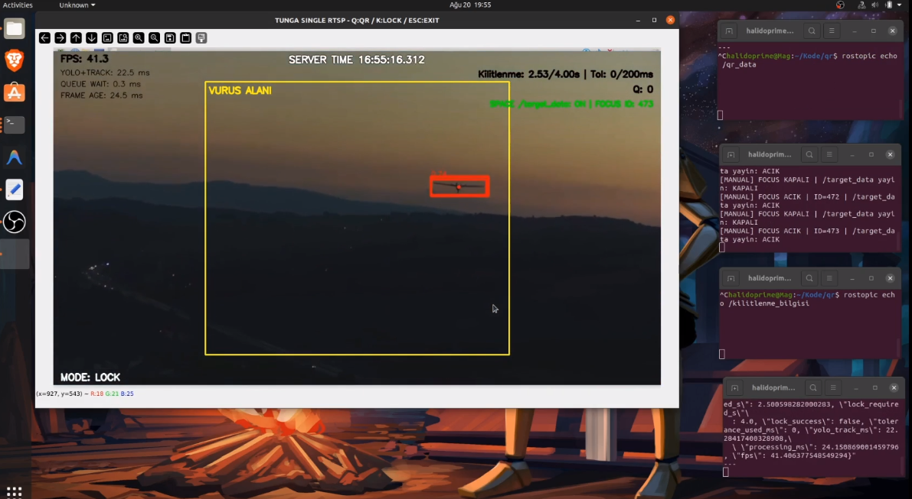
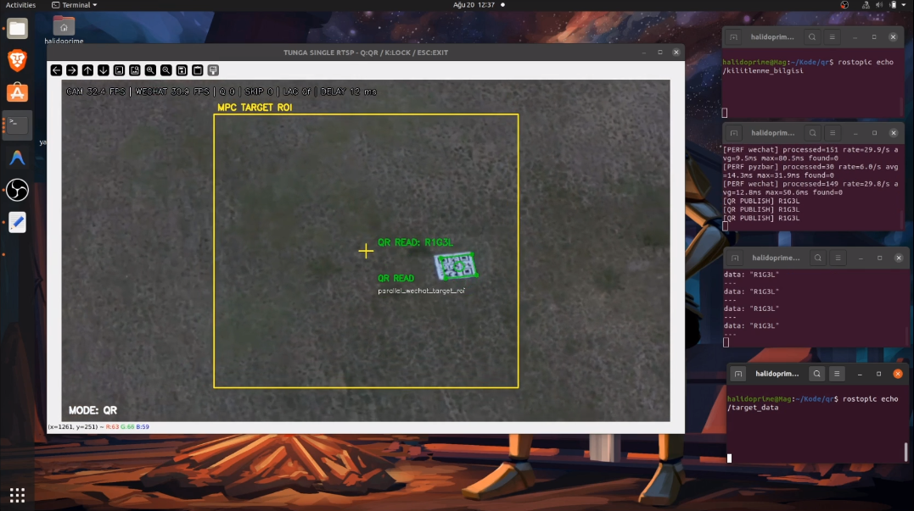
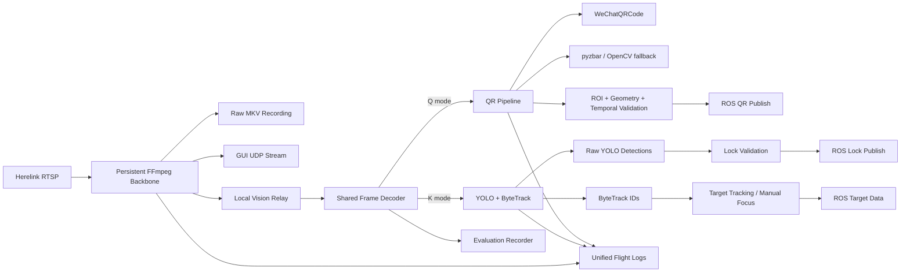

# TUNGA UAV Vision System

Real-time fixed-wing UAV vision software that combines **aerial target detection and tracking** with **QR detection and decoding during dive missions**. The final competition implementation runs both mission modes on a shared video backbone, integrates with ROS, records evaluation footage, and produces flight-level performance logs.

**Core stack:** Python · YOLO · ByteTrack · OpenCV · WeChatQRCode · pyzbar · ROS Noetic · FFmpeg · Herelink RTSP

> This repository is a cleaned portfolio/public version of the final integrated competition code. Large trained YOLO weights, flight logs, raw recordings, virtual environments, and local machine configuration are intentionally excluded.

## Real-Flight Demonstrations

### UAV Target Detection & Tracking



Real-flight target detection and persistent tracking with YOLO + ByteTrack. The lock pipeline also tracks lock duration, temporary target-loss tolerance, target validity, queue delay, processing time, and frame age. **The full-screen recording intentionally keeps the ROS terminals visible so target/focus and mission-topic output can be inspected alongside the vision pipeline.**

**[Watch the UAV tracking demo](assets/uav_tracking_demo.mp4)**

### QR Detection During UAV Dive



Real-flight QR detection and decoding during a UAV dive. The QR pipeline uses WeChatQRCode as the primary reader and combines geometric filtering, ROI logic, temporal validation, and fallback decoding. **The full-screen recording intentionally keeps the ROS terminals visible, showing decoded QR data being published live while the airborne image is processed.**

**[Watch the QR dive demo](assets/qr_dive_demo.mp4)**

## Highlights

- **Single persistent RTSP backbone:** one Herelink RTSP client feeds raw recording, GUI streaming, and the local vision decoder.
- **Mutually exclusive mission modes:** `Q` activates QR processing, `K` activates UAV lock/tracking, while the video backbone stays alive across mode switches.
- **Single YOLO inference path in LOCK mode:** the tracker exposes both raw YOLO detections and ByteTrack IDs from the same inference pass.
- **Competition lock logic:** 4-second lock timing with a built-in 200 ms temporary YOLO-miss tolerance in the final integrated implementation.
- **Multi-stage QR pipeline:** WeChatQRCode + pyzbar/OpenCV fallbacks, target ROI checks, geometry scoring, temporal consistency, and threaded processing.
- **ROS integration:** publishes tracking/lock/QR mission data and consumes server time.
- **Flight logging:** CSV metrics, system events, lock reports, QR worker statistics, and unified flight summaries.
- **Competition recording:** raw stream recording plus rendered evaluation video generation.

## System Architecture



A more detailed description is available in [docs/architecture.md](docs/architecture.md).

## Operating Modes

| Mode | Key | Purpose |
|---|---:|---|
| IDLE | startup | Video backbone, streaming and recording continue; no QR/YOLO inference |
| QR | `Q` | QR search, decode, validation and mission publishing |
| LOCK | `K` | YOLO detection, ByteTrack tracking, target lock and manual target control |

Additional controls in the final integrated application:

| Key | Action |
|---|---|
| `B` / `N` | Select previous / next tracked target in LOCK mode |
| `SPACE` | Toggle/focus the selected tracked target |
| `-` | Reset lock timer |
| `Z` | Cycle QR display zoom |
| `ESC` | Graceful shutdown |

## Repository Structure

```text
TUNGA-UAV-Vision-System/
├── main.py                         # Final integrated competition implementation
├── config.example.yaml             # Public configuration template
├── requirements.txt                 # Direct Python dependencies
├── requirements-opencv.txt          # Optional clean-env OpenCV-contrib install
├── .gitignore
├── src/
│   ├── tracker.py                  # YOLO + ByteTrack wrapper
│   ├── target_state.py             # Tracking state management
│   ├── metrics.py                  # Tracking output calculations
│   └── utils.py
├── scripts/
│   ├── setup_wechat_qrcode_models.sh
│   └── check_environment.py
├── docs/
│   ├── architecture.md
│   ├── installation.md
│   ├── target_tracking.md
│   ├── qr_pipeline.md
│   └── ros_interfaces.md
├── assets/
│   ├── uav_tracking_preview.png
│   ├── uav_tracking_demo.mp4
│   ├── qr_dive_preview.png
│   └── qr_dive_demo.mp4
├── weights/
│   └── README.md
└── wechat_qrcode_models/
    └── README.md
```

## Environment

The project was developed for a Linux/ROS UAV workflow. The original system used ROS Noetic and an FFmpeg-based RTSP pipeline.

Required system-level components:

- Python 3
- ROS Noetic with `rospy` and `std_msgs`
- FFmpeg
- ZBar runtime for `pyzbar`
- OpenCV with **WeChatQRCode / contrib** support for the primary QR reader

### Python packages

```bash
python3 -m pip install -r requirements.txt
```

`requirements.txt` covers the direct pip packages only. A **full competition run additionally requires ROS Noetic, FFmpeg, native ZBar, OpenCV with WeChatQRCode support, the trained YOLO weights, the four WeChat QR model files, a reachable RTSP source, and a live `/server_time` ROS topic.**

> **ROS/OpenCV note:** the repository intentionally does not force-install a specific OpenCV wheel in `requirements.txt`. On ROS Noetic systems, replacing the OpenCV build blindly can break other ROS/OpenCV integrations. Use an OpenCV-contrib build compatible with your environment. For a clean non-ROS Python environment, `requirements-opencv.txt` is provided.

See **[`docs/installation.md`](docs/installation.md)** for the complete dependency and runtime checklist.

## Setup

### 1. Clone the repository

```bash
git clone <YOUR_REPOSITORY_URL>
cd TUNGA-UAV-Vision-System
```

### 2. Create your local configuration

```bash
cp config.example.yaml config.yaml
```

Edit at least:

- `weights`
- `rtsp_url`
- `device`
- GUI stream destination if enabled

### 3. Add the trained YOLO model

Place your trained `.pt` model under `weights/` and update `config.yaml`:

```yaml
weights: weights/your_model.pt
```

The competition-trained weights are not included in this public repository.

### 4. Download WeChat QR models

```bash
chmod +x scripts/setup_wechat_qrcode_models.sh
./scripts/setup_wechat_qrcode_models.sh
```

The script downloads the detector and super-resolution model files into `wechat_qrcode_models/` and checks whether the active OpenCV build exposes WeChatQRCode support.

### 5. Check the environment

```bash
python3 scripts/check_environment.py
```

### 6. Run

Start ROS and the required `/server_time` source first, then:

```bash
python3 main.py
```

The application asks for the competition number before starting the flight session because the evaluation video filename is generated from that value.

## Example Configuration

The included `config.example.yaml` documents the public configuration surface. Important values include:

```yaml
capture_width: 1280
capture_height: 720
capture_fps: 30

conf_threshold: 0.20
iou_threshold: 0.45
imgsz: 1024

lock_duration_s: 4.0
```

The integrated code also supports separate processing dimensions, initial top crop, GUI streaming, evaluation recording, queue sizing, target-area ratios, and output-directory configuration.

## ROS Interfaces

The final integrated system uses ROS for mission data and shared server time. Main interfaces include:

| Topic | Direction | Purpose |
|---|---|---|
| `/server_time` | Subscribe | Authoritative server time used for mission timestamps |
| `/kamikaze_bilgisi` | Publish | Decoded QR / kamikaze mission information |
| `/target_data` | Publish | Selected/focused target tracking data |
| `/hedef_piksel` | Publish | Target pixel data |
| `/kilitlenme_bilgisi` | Publish | Successful lock information |

See [docs/ros_interfaces.md](docs/ros_interfaces.md) for implementation notes.

## Output and Logging

Each run creates a timestamped flight directory under the configured output directory. Depending on configuration, it can contain:

- raw camera recording (`.mkv`)
- competition/evaluation video (`.mp4`)
- `lock_frames.csv`
- `lock_report.txt`
- QR worker attempts and detections
- system events
- FFmpeg logs
- runtime metrics
- unified `summary.json` / `summary.txt`

Generated flight outputs are excluded from Git by default.

## Implementation Notes

The integrated final code is intentionally preserved in `main.py` instead of being aggressively rewritten for presentation. This keeps the competition-tested control flow intact while the reusable tracking utilities remain separated under `src/`.

The older standalone QR and UAV scripts are not included because the integrated version contains later performance, reliability, tracking, video-backbone, and logging improvements.

## Demo Media

The media in `assets/` comes from real flight tests. The demo videos are **full-screen desktop recordings** rather than cropped vision-only clips: the ROS terminals are intentionally retained because they show the live publish/subscribe behavior next to the visual result. Long raw onboard flight recordings are not part of the repository.
