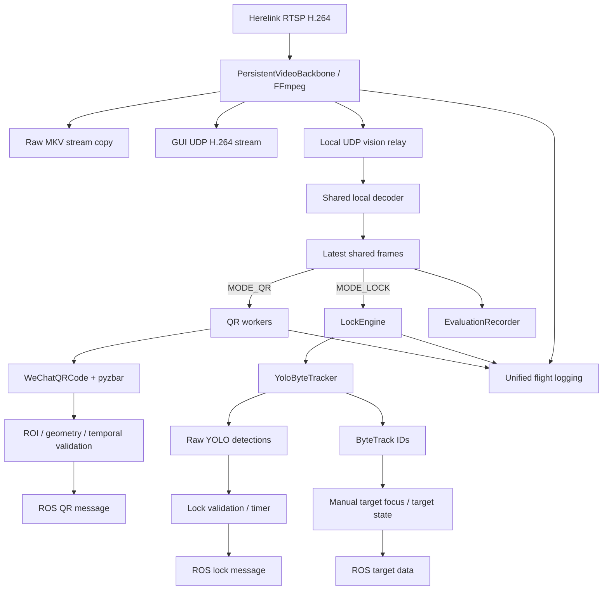

# Architecture

The final system was built around one design constraint: **mode changes must not restart the camera/streaming backbone**. QR and LOCK are therefore processing modes behind a persistent FFmpeg video path rather than separate applications opening the Herelink stream independently.

## High-level data flow

## Persistent video backbone

`PersistentVideoBackbone` owns the single RTSP input for the flight session. FFmpeg tees the compressed H.264 stream to three consumers:

1. raw recording,
2. GUI UDP output,
3. local vision relay.

The vision decoder consumes the local relay and produces the processing frames used by QR and LOCK. The `Q` / `K` mode switch changes inference behavior only; the backbone, raw recorder, GUI stream, and evaluation recorder are not intentionally restarted during mode changes.

## Mode lifecycle

The process starts in `IDLE` mode. In this mode the video path remains alive but expensive vision inference is inactive.

- `Q` -> QR mode. QR workers wake and LOCK/YOLO processing is inactive.
- `K` -> LOCK mode. Each LOCK frame is processed by the YOLO + ByteTrack path; QR workers sleep.
- switching away from a mode clears stale mode-specific queues/state without tearing down the RTSP client.

## Frame processing

The combined implementation supports an initial top crop before scaling/vision processing. The intent is for QR, YOLO, ByteTrack, display, and evaluation recording to operate on the same processed frame geometry.

Default public example values:

- processing size: 1280 x 720
- top crop: 36 px
- input target rate: 30 FPS

## Logging and recording

A run creates one timestamped flight directory. QR, LOCK, FFmpeg, and runtime metrics are collected into the same session so that timing and reliability can be reviewed after a flight.

Typical outputs include raw video, evaluation video, lock frame CSV, QR worker logs, system events, FFmpeg logs, and final summary files.
